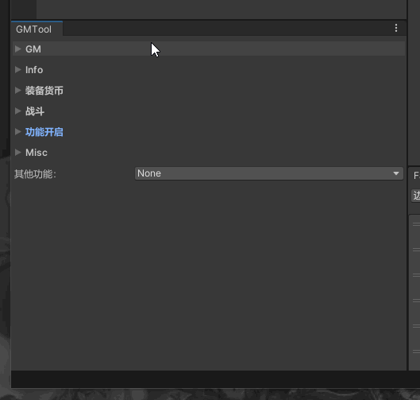
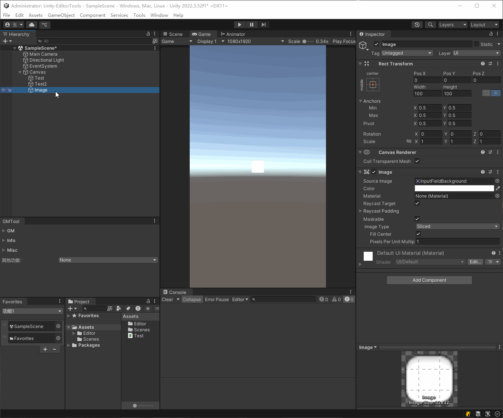

# 一些Unity编辑器工具
## 资源收藏夹

支持拖拽收藏资源或文件夹、点击定位、拖动排序、多组收藏、删除、重命名组

 

## GM工具窗口

工作之后发现很多项目的开发效率工具做的很差，甚至是没有，有时候一些复杂的功能调试起来很不方便
这对于我这个追求效率的人来说很是难受，于是就出现了这个工具，它已经在我经历的多个开发项目中使用并替代了原本的开发工具
只需要稍微了解一些unity编辑器开发知识或者参考我给出的例子，就可以方便的添加出各种属性监视或者触发功能

以下是在其中一个项目中的实际使用演示（本项目中只有壳子，具体功能需要开发中逐渐增加）

 

## 挂特么哪了！

一些项目喜欢大量使用继承MonoBehaviour挂载的方式开发，个人没有偏向，挂载和不挂载的方式各有优略，但是挂载的方式有一个常见的问题：
”**这特么到底挂哪了！**"
然后就开始机械化的翻找到底是谁在控制他，这很浪费时间，所以就出现了这个工具 —— **挂特么哪了！**

##### 使用方式：右键需要的查找的物体，点击**挂特么哪了！**

然后就会在Console中输出所有挂载了这个物体（包括自身和挂载的所有的Component）的对象信息，然后将字段名复制到剪贴板，并且自动选中目标

如果这个物体或他的组件挂载在多个对象中，会将这多个对象全部输出到Console中，点击log可以选中目标

 

# 快速选中UI

unity自从某个版本之后scene视图选中逻辑变成了从外层到内层，导致在复杂的ui中想要选中想要的物体非常困难
这个工具可以实现快速选中ui，在Game视图中按下鼠标中键可以快速选中渲染在最前方的ui组件，在鼠标不移动的情况下多次点击可以由上至下循环选中

 

